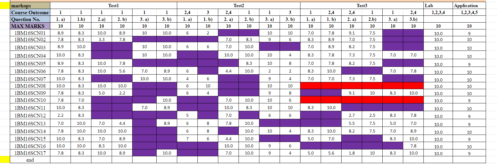
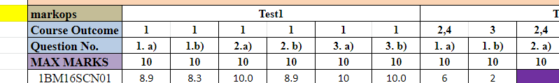
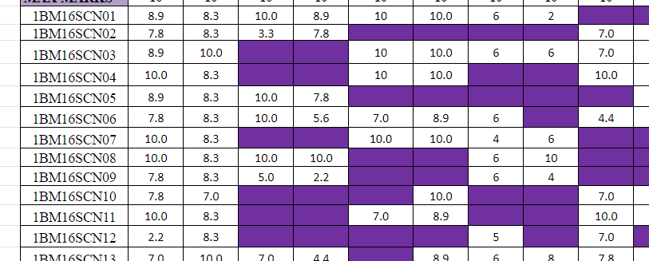

# Spreadsheet Format

In order to use MarkOps, you will need to follow a specific format for the spreadsheets that you will upload. The format is given below :-

Note the words 'markops' and 'end' at the start and end of the spreadsheet. You will need to add these values in your spreadsheet in order to assist us in parsing it. Also note. you can have as many tests, labs and applications as you like, this will not affect the application so long as you follow the specified format.

### Rules

To explain the format a bit indepth, here is a set of rules to follow:-

- The first set of rows must go in the following order:

  

  The first row must start with the word "markops" and from there you can add tests, labs etc

  The second row must start with the word "Course outcome" and from there you can add CO values corresponding to the question. If a question has multiple CO values, simply denote all the values seperated by commas (Ex: 2,4)

  The third row must start with the word "Question" and from there you can add any name you like, these values won't be parsed and for the teacher's reference only.

  The fourth row must start with the word "Max" and from there you can add values that represent the maximum marks that can be gained for that question. Please note, the **values must be a number and cannot be empty**.

- The next set of rows can start with a name or id (Ex: 1BM16SCN01). These values will not be parsed and for the teacher's reference. From there you can add values (must be less than Max and cannot be negative). The values can be empty. Empty values are treated as not attempted. 

  

  